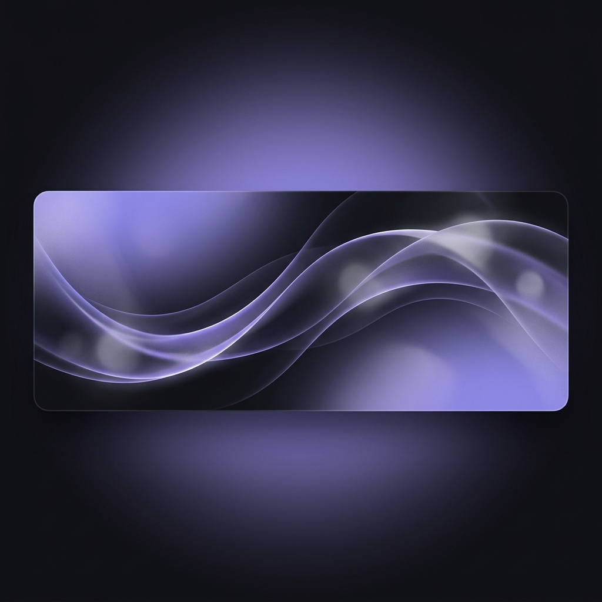

# 👋 Hi, I'm BlazeR

**Hobby Developer & 3D Creative Explorer**

---

---

### 🚀 About Me
I am a passionate hobbyist programmer and 3D designer focused on building clean desktop utilities, automating workflows, and experimenting with 3D visualization. I love creating tools with polished user interfaces following my signature dark slate-purple design language.

**Current Focus:**
C# (.NET, WinUI 3, WPF) | Python Automation | Blender 3D Rendering

---

### 💻 Featured Projects

<table align="center" width="100%">
  <tr>
    <td width="50%" align="left" valign="top">
      <strong>🚀 <a href="https://github.com/BlazeR-28/QuickText">QuickText</a></strong> 
      A premium standalone C# WPF WebView2 note-taking scratchpad. Features customizable global/local shortcuts, adjustable layered window opacity, autosave, and a Liquid Glass styled settings panel.
    </td>
    <td width="50%" align="left" valign="top">
      <strong>🛠️ <a href="https://github.com/BlazeR-28/OmniUp">OmniUp (V6)</a></strong> 
      A modern C# WinUI 3 desktop client designed to manage and perform global system updates utilizing <code>winget</code>. Designed with a custom navigation sidebar and desaturated dark visuals.
    </td>
  </tr>
  <tr>
    <td width="50%" align="left" valign="top">
      <strong>🌐 Local Web Hosting Suite</strong> 
      A Docker-based development environment mapping wildcard domains (*.blazer, *.localhost) to subfolders using Traefik v3 and a custom Nginx container.
    </td>
    <td width="50%" align="left" valign="top">
      <strong>🎙️ Handy App</strong> 
      An offline Windows speech-to-text dictation client, integrating Ollama with <code>gemma2:9b</code> to automatically correct grammar and remove filler words in the background.
    </td>
  </tr>
</table>

---

### 🛠️ Tech Stack & Tools

  
  
  
  
  
  

---

### 📊 GitHub Analytics

  

  

---

### 🌐 Let's Connect

  
  &nbsp;&nbsp;
  

---

"Progress over perfection. Still learning and growing every day."

